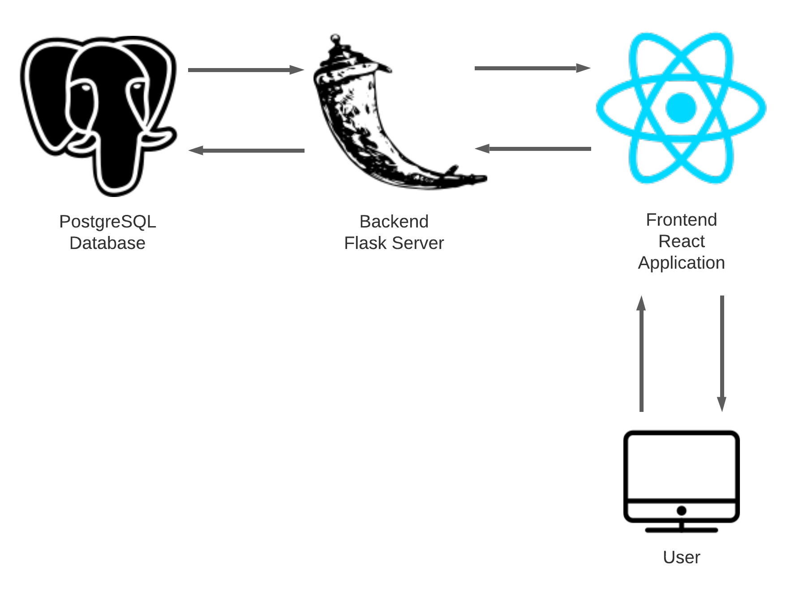

# Amazoff

Amazoff is simply a better version of Amazon. Our application consists of many improvements over
Amazon's markeplace including, but not limited to:
- Smoother, more dynamic UI
- Highly secure account/password management
- Modernized microservice architecture using React.js and Flask

## Design

Our applications consists of a postgresql database, flask application, and react application:


Our database design can be seen [here](./db-design.md)

## Setup and Running

### Setup

All parts of our application are expected to be run on a GCP Ubuntu VM with at least 4GB of memory.
The following are expected to be installed already:
- PostgreSQL and psql

Once these are installed and the repository is cloned, we can install all external dependencies
for our application by running (in root [amazoff](/../../) directory)
```
cdhmod +x install.sh
./install.sh
```
More documentation on installation [here](./installation.md)

### Running the application

Once installation is complete, the backend server should first be run in its own terminal:
```
cd backend
pipenv run flask run
```
Then, the frontend server should be run in a separate terminal:
```
cd frontend
npm start
```

Once both servers are running, the app can be accessed at http://\<external-ip>:3000
(or http://localhost:3000 if using port-forwarding)


